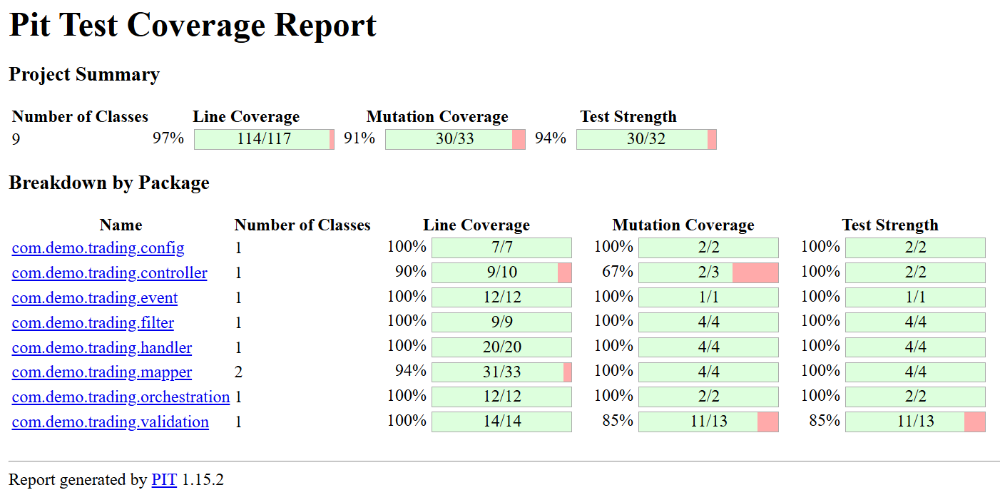

# Order Trading System : Demo - Only Happy Status Journey

## Application Goal
**To simulate an end-to-end order trading workflow using microservices event-driven architecture.**  
**The system accepts order placements, publishes them to Kafka, processes the response from a simulated exchange, and saves the order history in DynamoDB.**

---

## Project Alignment

| Requirement                         | Implementation in this Project                                                                                                        |
|-------------------------------------|---------------------------------------------------------------------------------------------------------------------------------------|
| **Core Java, Multithreading, SOLID** | Used `CompletableFuture`, custom executors, proper separation of concerns, and SOLID-based component design.                          |
| **Event-Driven Architecture**       | Integrated Kafka for producing and consuming trade events. Trade lifecycle is modeled using event transitions.                        |
| **Reactive Design Principles**      | Non-blocking async processing using `CompletableFuture`                                                                               |
| **DynamoDB (NoSQL)**                | To persist order lifecycle events asynchronously in a scalable, event-driven format.                                                  |
| **DevOps & Agile Practices**        | JUnit for unit testing, clear separation of modules, and extensible for BDD with Cucumber.                                            |
| **Cloud Awareness**                 | Design is cloud-deployable Microservices. Can be easily hosted on AWS/Azure using standard containerization or cloud-native services. |


##  Prerequisites

### Dev Tools
- Java 21+
- Maven 3+
- Docker (for running Kafka & Zookeeper)
- IntelliJ

### Infra / Services
- **Kafka** (via Docker Compose)
- **Zookeeper** (for Kafka broker)
- **DynamoDB Local** (optional, via Docker or local install)

---

## Tech Stack
- Java 21
- Spring Boot 3.2.4
- Spring Kafka
- DynamoDB Enhanced Client (AWS SDK v2)
- Docker + Docker Compose
- JUnit 5 + Mockito + PIT Mutation Testing
- Lombok

---

## Architecture Overview

```text
=========================
     API (REST)        
=========================
            |
            v
==========================
  Order Service          
  - Receives orders      
  - Validates request    
  - Publishes to Kafka   
  - Save DB :order Status
==========================
            |
            v
==========================
 Kafka Topic: order-events   
==========================
            |
            v
==============================
  Order Subscriber            
  - Listens to events         
  - Calls Exchange (stub)     
  - Save DB :order Status    
==============================
```

---

## Running the App (Local)
Check `z-dockercompose` folder for `kafka-dev.yml` & `dynamodb-local-db.yml`.

### Start Kafka & Zookeeper
```bash
docker-compose -f kafka-dev.yml up
```

### Start DynamoDB Local
```bash
docker-compose -f dynamodb-local-db.yml up
```

### Build the App
```bash
mvn clean install
```

### Run Order Service
```bash
cd order-service
java -jar target/order-service-0.0.1-SNAPSHOT.jar
```

### Run Subscriber
```bash
cd order-subscriber
java -jar target/order-subscriber-0.0.1-SNAPSHOT.jar
```

---

### cURL Example
```bash
curl --location 'http://localhost:8081/orderservice/orders/placeorder' \
--header 'Content-Type: application/json' \
--header 'user-id: YA5488' \
--data '{
    "product": "MIS",
    "quantity": 60,
    "price": 77.0,
    "tradingsymbol": "Apple",
    "exchange": "NSE",
    "validity": "DAY",
    "transaction_type": "BUY",
    "order_type": "MARKET"
}'
```

## Sample Data - OrderHistoryTable (DynamoDB)

### Summary View (eventType: PLACED & COMPLETED)

| Field              | PLACED Example          | COMPLETED Example            |
|--------------------|--------------------------|------------------------------|
| `orderId` (PK)     | abc-123                  | abc-123                      |
| `eventType` (SK)   | PLACED                   | COMPLETED                   |
| `userId`           | YA5488                   | YA5488                      |
| `tradingSymbol`    | API                      | API                         |
| `quantity`         | 60                       | 60                          |
| `orderType`        | MARKET                   | MARKET                      |
| `transactionType`  | BUY                      | BUY                         |
| `status`           | SUCCESS                  | SUCCESS                     |
| `errorMessage`     | null                     | null                        |
| `sourceService`    | order-service            | order-subscriber            |
| `exchangeResponse` | null                    | { "price": 77.05, "exchangeTime": "..." } |
| `timestamp`        | 2025-03-30T09:00:00Z     | 2025-03-30T09:00:05Z        |


## Unit + Mutation Coverage
 - The order-service module is validated using:

- JUnit 5 for unit testing

- Mockito for mocking
- PIT Mutation Testing for mutation strength and effectiveness

Report : 

